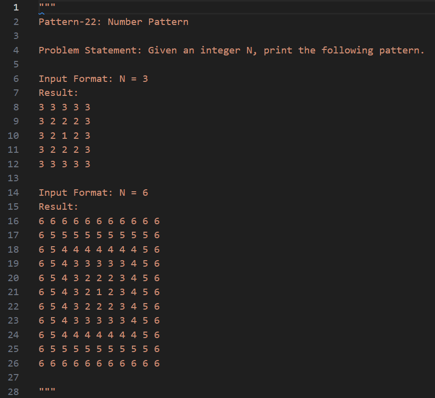

# Pattern-problems-using-python

Source of Pattern problems are [takeuforward.org](https://takeuforward.org/strivers-a2z-dsa-course/must-do-pattern-problems-before-starting-dsa/).

Same explaination is present in each file like:




Run the patterns programs as per below:

    ```shell

    # Go to directory where pattern program are present
    cd path_to_pattern_directory

    # Run the patterns program Pattern-22-Number-Pattern.py using below command
    python Pattern-22-Number-Pattern.py

    ```
s